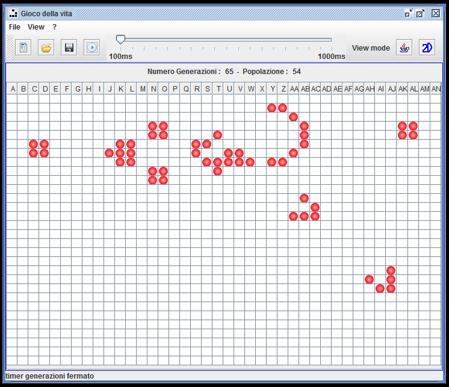
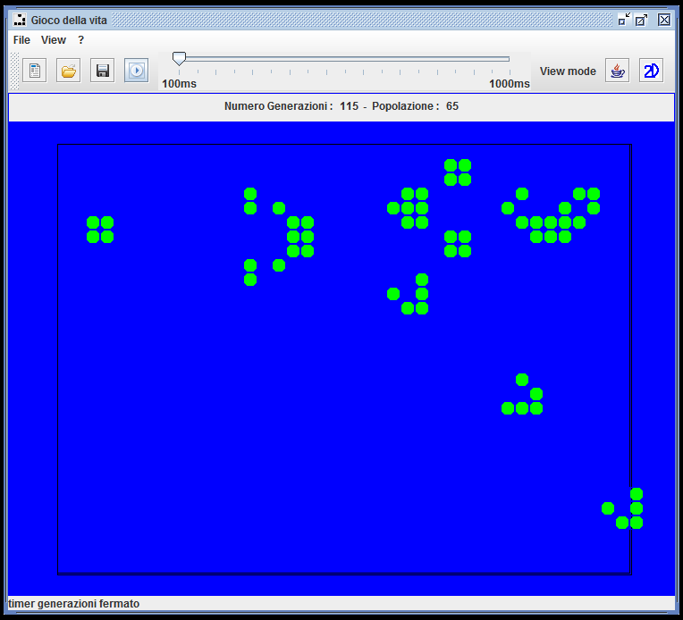
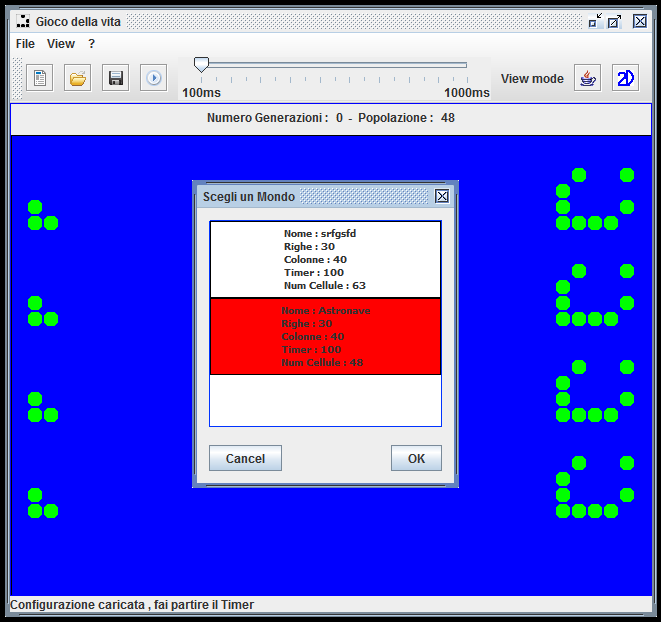

# Game of Life

  
Simple example of java swing application , developed on MVC framework Ping (Unibas).

  
Two type of visualization, swing jTable and java2d.  
    You can start/stop the cells generation, add/remove cells and in java2D mode you can move the world :) 
  

  

    You can save/load current configuration to file .property or XML and you can save/load on database Derby (Embedded Derby JDBC).
  

  
ScreenShot : 
       
       
       
   

